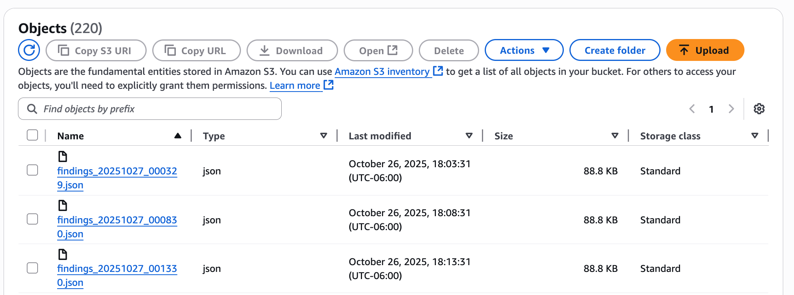
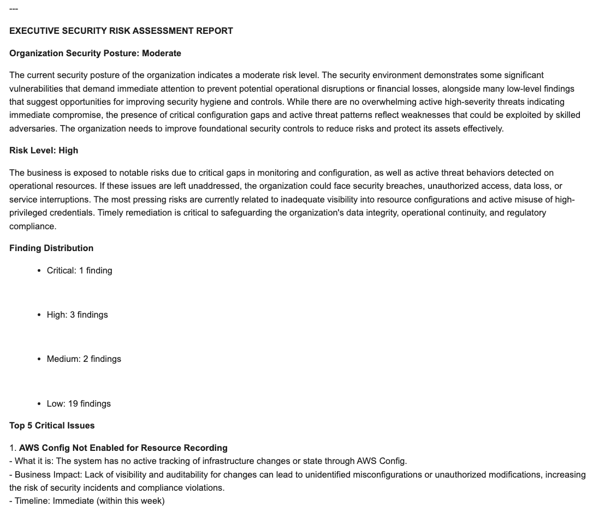
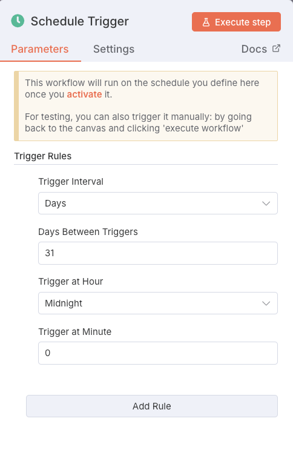

# AWS Security Risk Assessment Agent

> An intelligent automation that transforms AWS Security Hub findings into executive-ready risk assessment reports—delivered directly to your inbox on a schedule.

[](https://n8n.io)
[](https://openai.com)
[](https://aws.amazon.com/security-hub/)

## 🎯 Overview

The AWS Security Risk Assessment Agent automatically analyzes your AWS Security Hub findings and generates comprehensive, business-focused risk assessment reports. Instead of wading through hundreds of technical security alerts, leadership receives clear, actionable insights in plain English—delivered via email on your preferred schedule.

### Key Benefits

- 📊 **Executive-Ready Reports**: Technical findings translated into business impact language
- ⏱️ **Automated Scheduling**: Daily, weekly, or monthly reports—set it and forget it
- 🎯 **Prioritized Actions**: Clear guidance on what to fix first and why
- 💼 **Board-Level Clarity**: No security jargon—just business risk explanations
- 📈 **Trend Visibility**: Track security posture improvements over time
- ⚡ **Instant Analysis**: What takes security analysts hours is done in seconds

## 🎬 Demo

### Automated Security Analysis

*AWS Security Hub findings are automatically retrieved from S3*

### AI-Generated Risk Report

*Executive summary with prioritized actions delivered via email*

### Scheduled Execution

*Configure daily, weekly, or monthly automated reports*

## 💡 The Problem

### Traditional Security Reporting Process

```
AWS Security Hub generates alerts
    ↓
Security analyst manually reviews findings
    ↓
Analyst categorizes by severity and priority
    ↓
Analyst researches business impact for each finding
    ↓
Analyst writes executive summary (4-8 hours)
    ↓
Analyst creates prioritized action plan
    ↓
Report sent to leadership
    ↓
Process repeats weekly/monthly
```

**Result**: Security analysts spend 20-40% of their time on report generation instead of fixing issues.

### The AI Risk Assessment Solution

```
AWS Security Hub → S3 → n8n Agent → AI Analysis → Email Report
```

**Result**: Automated, consistent reports in seconds. Security team focuses on remediation, not documentation.

## 🏢 Use Cases

### 1. Executive Briefings
**Scenario**: CISO needs weekly security posture updates for executive team  
**Traditional**: Security analyst spends 4 hours writing summary  
**With AI Agent**: Automated report every Monday at 8 AM  
**Impact**: 16 hours/month saved, consistent reporting cadence

### 2. Board Reporting
**Scenario**: Quarterly board meeting requires security risk overview  
**Traditional**: Manually compile findings, create slides, write narrative  
**With AI Agent**: Generate comprehensive report on-demand in 30 seconds  
**Impact**: Board-ready documentation without days of prep work

### 3. Compliance Audits
**Scenario**: Auditors request evidence of regular security assessments  
**Traditional**: Pull historical data, write status reports retrospectively  
**With AI Agent**: Automated historical record of security posture  
**Impact**: Instant audit trail, demonstrates continuous monitoring

### 5. Multi-Account Management
**Scenario**: Organization with dozens of AWS accounts to monitor  
**Traditional**: Manually review each account's Security Hub findings  
**With AI Agent**: Consolidated analysis across all accounts  
**Impact**: Holistic security view without manual aggregation

### Workflow Components

**1. Schedule Trigger**
- Runs on your preferred cadence (daily, weekly, monthly)
- Can also be triggered manually for on-demand reports

**2. S3 Bucket Search**
- Retrieves latest Security Hub findings from designated S3 bucket
- Supports multiple files for historical analysis

**3. File Download & Extraction**
- Downloads JSON files containing security findings
- Extracts structured data for analysis

**4. AI Agent Analysis**
- GPT-4 analyzes all findings with specialized security analysis prompt
- Categorizes by severity (Critical, High, Medium, Low)
- Translates technical findings into business impact language
- Generates prioritized action plan

**5. Report Formatting**
- Converts markdown analysis to formatted HTML
- Applies professional styling for readability
- Prepares email-ready document

**6. Email Delivery**
- Sends executive summary to specified recipients
- Includes risk rating, top findings, and recommended actions

## 📊 What The Report Includes

### Executive Security Posture Summary
- **Overall Risk Rating**: Critical/High/Medium/Low
- **Security Posture Assessment**: Strong/Moderate/Weak/Critical
- **Business Impact Explanation**: What this means for the organization
- **Findings Distribution**: Breakdown by severity level

### Top 5 Critical Issues
For each critical issue:
- **What it is**: Simple, non-technical explanation
- **Business Impact**: Real-world consequences if unaddressed
- **Timeline**: How urgently it needs attention
- **Affected Resources**: Which systems are vulnerable

### Prioritized Action Plan

**Immediate Actions (This Week)**
- Critical findings requiring immediate attention
- Step-by-step remediation guidance
- Expected outcomes after fixes

**Short-Term Actions (30 Days)**
- High-priority findings to address soon
- Resource requirements and effort estimates

**Medium-Term Actions (90 Days)**
- Medium-priority improvements
- Strategic recommendations

### Key Leadership Recommendations
- Top 3 strategic priorities
- Resource allocation guidance
- Risk acceptance vs. remediation decisions

## 💼 Business Impact

### For Security Teams
- ✅ Eliminate 15-20 hours/month of manual report writing
- ✅ Focus on remediation instead of documentation
- ✅ Consistent, high-quality reporting every time
- ✅ Instant visibility into security posture changes

### For Leadership
- ✅ Understand security risk without technical expertise
- ✅ Make informed decisions about resource allocation
- ✅ Demonstrate security diligence to board and investors
- ✅ Track security improvement trends over time

### For Compliance Teams
- ✅ Automated audit trail of security monitoring
- ✅ Evidence of continuous risk assessment
- ✅ Documentation for SOC 2, ISO 27001, and other frameworks
- ✅ Rapid response to auditor requests

### Metrics & ROI

**Time Savings**
- Manual report creation: 4-8 hours → 30 seconds (99.99% faster)
- Weekly reports: 32 hours/month saved
- Annual time savings: 384 hours (equivalent to 0.18 FTE)

**Cost Efficiency**
- AI analysis cost: ~$0.10-0.50 per report
- Eliminates need for dedicated security reporting analyst
- ROI achieved within first week

**Quality Improvements**
- 100% consistent report format and analysis
- Comprehensive coverage of all findings

## 🎯 Sample Report Output

The AI agent generates reports in this format:

```
EXECUTIVE SECURITY RISK ASSESSMENT REPORT

Organization Security Posture: MODERATE
Our AWS environment shows a moderate security posture with several 
areas requiring attention. While we have strong baseline protections 
in place, there are 23 findings that need remediation to reduce our 
risk exposure. The good news is that most issues are configuration-
related and can be addressed without major infrastructure changes.

Risk Level: MEDIUM
The current risk level is MEDIUM, meaning that while we're not facing 
immediate critical threats, there are vulnerabilities that could be 
exploited if left unaddressed. We recommend prioritizing the 8 HIGH 
severity findings within the next 30 days.

Finding Distribution
- Critical: 2 findings
- High: 8 findings
- Medium: 11 findings
- Low: 2 findings

Top 5 Critical Issues

1. Unencrypted S3 Buckets Containing Sensitive Data
   - What it is: Three S3 buckets storing customer data lack encryption
   - Business Impact: Data breach risk with potential regulatory fines 
     and customer trust damage
   - Timeline: Fix this week

2. Overly Permissive IAM Policies
   - What it is: Several users have admin access when they only need 
     limited permissions
   - Business Impact: Insider threat risk and potential for accidental 
     misconfigurations
   - Timeline: Review and restrict within 30 days

[Additional findings...]

Immediate Actions Required (This Week)
1. Enable S3 bucket encryption for customer data buckets
   - Why: Prevents data exposure in event of unauthorized access
   - Expected Outcome: Customer data protected at rest
   - Effort: Low (30 minutes per bucket)

[Additional actions...]

Key Recommendations for Leadership
- Prioritize encryption for all customer-facing data stores
- Conduct IAM policy audit to implement principle of least privilege
- Allocate 8 engineering hours this week for critical fixes
```

## 🔐 Security & Privacy Considerations

### Data Handling
- ✅ Security findings stay within your AWS environment
- ✅ Only exported JSON files are processed by n8n
- ✅ No sensitive data sent to OpenAI (only finding metadata)
- ✅ Reports can be encrypted in transit via TLS

### Access Control
- ✅ Restrict S3 bucket access to n8n service account only
- ✅ Use IAM roles with minimum required permissions
- ✅ Email reports only to authorized recipients
- ✅ Consider using AWS KMS for S3 bucket encryption

### Best Practices
- Review AI-generated reports initially to validate accuracy
- Don't include actual credentials or secrets in Security Hub
- Use separate S3 bucket exclusively for Security Hub exports
- Implement lifecycle policies to archive old reports
- Regularly rotate AWS IAM credentials used by n8n

## ❓ Frequently Asked Questions

### General Questions

**Q: How accurate are the AI-generated reports?**  
A: The AI analyzes actual Security Hub findings—it doesn't invent data. The analysis and prioritization are based on AWS best practices and security frameworks. Initial reports should be reviewed by your security team to validate recommendations match your specific context.

**Q: What if I don't have AWS Security Hub enabled?**  
A: Security Hub is required as the data source. However, it's free for the first 30 days and costs ~$0.001 per 10,000 findings after that—negligible cost for most organizations.

**Q: Can it analyze findings from multiple AWS accounts?**  
A: Yes. You can aggregate Security Hub findings from multiple accounts into a single S3 bucket, or run separate workflows per account.

**Q: How long does report generation take?**  
A: Typically 20-45 seconds depending on the number of findings. Most time is spent on AI analysis, not data retrieval.

**Q: What if I want reports in a different format (PDF, Slack, etc.)?**  
A: The workflow can be modified. Instead of Gmail, add nodes for Slack, Microsoft Teams, or export to PDF. n8n supports dozens of integrations.

**Q: How much does it cost to run?**  
A: Costs breakdown:
- AWS Security Hub: Free tier, then ~$0.001 per 10,000 findings
- AWS S3: Negligible storage costs
- OpenAI GPT-4: ~$0.10-0.50 per report (depending on findings volume)
- n8n: Free tier covers this workflow easily
- **Total: ~$10-30/month for weekly reports**

**Q: Can I customize the report format or content?**  
A: Yes. The AI Agent node contains a detailed system prompt that defines report structure and content. You can modify this prompt to adjust:
- Report sections included
- Level of technical detail
- Prioritization criteria
- Tone and language style

**Q: What if Security Hub findings change between reports?**  
A: Each report is a point-in-time snapshot. You can configure the workflow to fetch the latest findings each time it runs, ensuring reports reflect current state.

**Q: Does this work with other cloud providers (Azure, GCP)?**  
A: This workflow is AWS-specific. However, the concept can be adapted for Azure Security Center or GCP Security Command Center by modifying the data source nodes.

### Business Questions

**Q: Will this replace our security analyst?**  
A: No—it augments them. The agent handles report generation, freeing analysts to focus on remediation, threat hunting, and strategic security initiatives.

**Q: Can non-technical executives understand these reports?**  
A: Yes. The AI specifically avoids technical jargon and explains findings in business impact terms. Phrases like "unencrypted database" become "customer data at risk of exposure."

**Q: How do we handle false positives?**  
A: Security Hub allows you to suppress specific findings. The AI will work with whatever findings Security Hub provides. You can also add instructions in the AI prompt to deprioritize certain types of findings.

**Q: What if we have unique compliance requirements?**  
A: Customize the AI agent's system prompt to include your specific compliance frameworks (HIPAA, PCI DSS, etc.) and it will incorporate those perspectives into the analysis.

**Q: Can we track improvement over time?**  
A: Yes. Archive reports in a dedicated folder and compare month-over-month. You could also extend the workflow to log findings counts to a database for trending dashboards.

**Q: Is this suitable for startups or only enterprises?**  
A: Both. Startups benefit from automated reporting without hiring a full security team. Enterprises benefit from consistency and time savings across large environments.

## 🎓 Best Practices

### Initial Setup
1. **Start with manual execution**: Run a few reports manually to validate output quality
2. **Review with security team**: Have your security experts review first few reports
3. **Calibrate the AI prompt**: Adjust the system message based on your organization's needs
4. **Test email delivery**: Ensure formatting looks good in your email client

### Ongoing Usage
1. **Set appropriate schedule**: Weekly for most organizations, daily for high-security environments
2. **Archive reports**: Keep historical reports for trend analysis and audit evidence
3. **Act on findings**: Reports are only valuable if findings are remediated
4. **Review prompt periodically**: As your security program matures, update the AI prompt

### Advanced Tips
1. **Multi-account aggregation**: Set up Security Hub delegated administrator for org-wide view
2. **Custom severity mapping**: Adjust Security Hub finding severities to match your risk tolerance
3. **Integration with ticketing**: Extend workflow to create Jira tickets for high-priority findings
4. **Metric tracking**: Add nodes to log findings counts to a database for dashboards

---

## 🎯 Quick Stats

- ⚡ **Report Generation**: 20-45 seconds
- 💰 **Monthly Cost**: ~$10-30 (varies with findings volume)
- 🚀 **Setup Time**: 10-15 minutes
- 📈 **Time Savings**: 15-20 hours/month for security teams
- 📊 **Consistency**: 100% standardized reports every time

---

<div align="center">

**Built with ❤️ using [n8n](https://n8n.io) + [GPT-4](https://openai.com) + [AWS Security Hub](https://aws.amazon.com/security-hub/)**

⭐ Star this repo if you find it useful!

</div>

---

## 📸 Screenshots

### AWS Security Hub Integration

*Automated retrieval of Security Hub findings from S3*

### AI-Generated Executive Report

*Business-focused risk analysis delivered via email*

### n8n Workflow Canvas

*Visual workflow showing automated analysis pipeline*

---

*Transform raw security data into actionable executive insights—automatically.*
